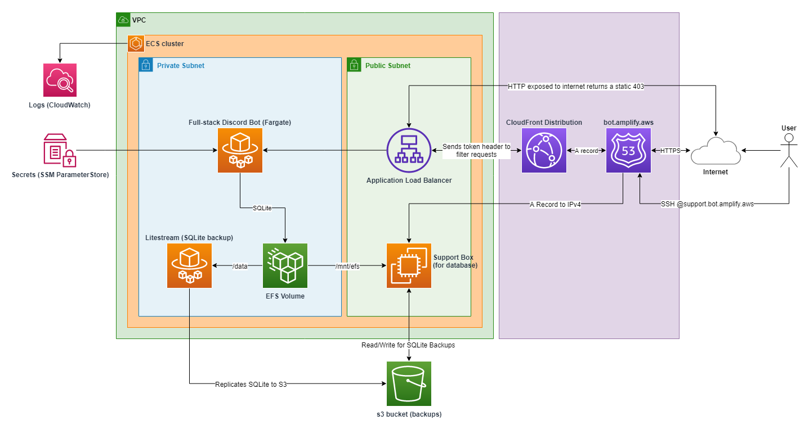

# Contributing

Refer to the [readme guide](./README.md#getting-started) to get started.

## Resources

- [Carbon DevTools Chrome Extension](https://chrome.google.com/webstore/detail/carbon-devtools/oejjaglcafcolafkjecfkoojgnpfpgca)
- [Carbon Components Svelte](https://carbon-components-svelte.onrender.com/)
- [Carbon Icons Svelte](https://carbon-icons-svelte.onrender.com/)
- [discord.js](https://discord.js.org/#/docs/discord.js/main/general/welcome)
- [`@discordjs/builders` Slash Command Builder](https://github.com/discordjs/discord.js/blob/main/packages/builders/docs/examples/Slash%20Command%20Builders.md)

## Repository Reference

- [`cdk/`](./cdk) - AWS CDK application to deploy apps
- [`docs/`](./docs) - Documentation related to project including architecture diagrams
- [`tests/`](./tests) - End-to-end test suite powered by [Vitest](https://vitest.dev/), supports in-source unit testing
- [`packages/`](./packages) - collection of library packages, including Discord, support helpers, and a shared TypeScript configuration
- [`scripts/`](./scripts) - small CLI helper for automating tasks

## Architecture Reference



## Git Hooks

It is recommended to use the provided git hooks to save time by verifying your changes before filing a pull request.

```bash
git config core.hookspath .git-hooks
```

## Authoring Discord Commands

To get started, let's create a new command file in `src/lib/discord/commands`: `hello.ts`

```ts
import { SlashCommandBuilder } from '@discordjs/builders'
import type { ChatInputCommandInteraction } from 'discord.js'

export const config = new SlashCommandBuilder()
  .setName('hello')
  .setDescription('Says hello to the world (or everyone)')
  .addStringOption((option) =>
    option
      .setName('name')
      .setDescription('Say hello to this name')
      .setRequired(true)
      .addChoices(
        { name: 'world', value: 'world' }
        { name: 'everyone', value: 'everyone' }
      )
  )

export function handler(interaction: ChatInputCommandInteraction): string {
  const name = interaction.options.getString('name') as string
  return `Hello, ${name}!`
}

if (import.meta.vitest) {
  const { test } = import.meta.vitest
  test.todo('/hello')
}
```

<!-- ```ts
import { createCommand, createOption } from '$discord'

const name = createOption({
  name: 'name',
  description: 'The name of the user to greet.',
  required: true,
  choices: ['world', 'everyone'],
})

export default createCommand({
  name: 'hello',
  description: 'Say hello',
  options: [name],
  handler: (context) => {
    const [name] = context.data.options
    return `hello ${name.value}`
  },
})
``` -->

## Creating Secrets in SSM

**[scripts](./scripts)**

Create secrets in SSM Parameter Store with the `scripts` helper! Rename `.env.sample` to `.env.next` and create secrets with the following command:

```bash
pnpm scripts create-secrets -e next
```

**NOTE:** dotenv files are loaded using Vite's `loadEnv` and `local` dotenv files are not supported when creating secrets. Additionally, we must be sure to pass a valid environment name such as `main` or `next`

## Deployment

For the deployment we will work primarily in the [`cdk`](./cdk) directory, where the [AWS CDK CLI](https://www.npmjs.com/package/aws-cdk) is installed locally to the package.

1. if not already done, bootstrap the environment with `pnpm cdk bootstrap`
2. ensure we are able to synthesize the stack: `pnpm cdk synth`
   1. alternatively we can synthesize an environment-specific stack: `pnpm cdk synth -c env=next`
3. deploy the stack with `pnpm cdk deploy`

### Typical Workflow

Deploy for environment `next`

1. `pnpm cdk synth -c env=next`
2. `pnpm cdk deploy -c env=next`

Destroy resources associated with environment `next`

1. `pnpm cdk destroy -c env=next`

## Testing

Run the tests with `pnpm test`. This will launch Vite in `test` mode, which will load secrets from `.env.test` if it exists. In a CI setting it is recommended to use a separate set of secrets unique to the test flow.

You can also launch a UI for the tests with [`pnpm vitest --ui`](https://vitest.dev/guide/ui.html#vitest-ui)

### Unit Tests

This project supports [in-source testing powered by Vitest](https://vitest.dev/guide/in-source.html). To get started, at the **end of the file** add the following:

```ts
// ... implementation

if (import.meta.vitest) {
  const { test } = import.meta.vitest
  test.todo('my unit test')
}
```

> **_NOTE:_** in-source testing with Vitest does not tree-shake dependencies, which could lead to ambiguous errors caused by circular references

When `pnpm test` is run from the project root, the newly added test is executed alongside the e2e tests.

## Docker

Build individual apps using [`docker compose`](https://docs.docker.com/compose/):

- `docker compose up bot --build`

Build manually with:

```shell
docker build -t bot .
```

Run manually with:

```shell
docker run --rm \
  --name bot-local
  -p 3000:3000 \
  bot
```
