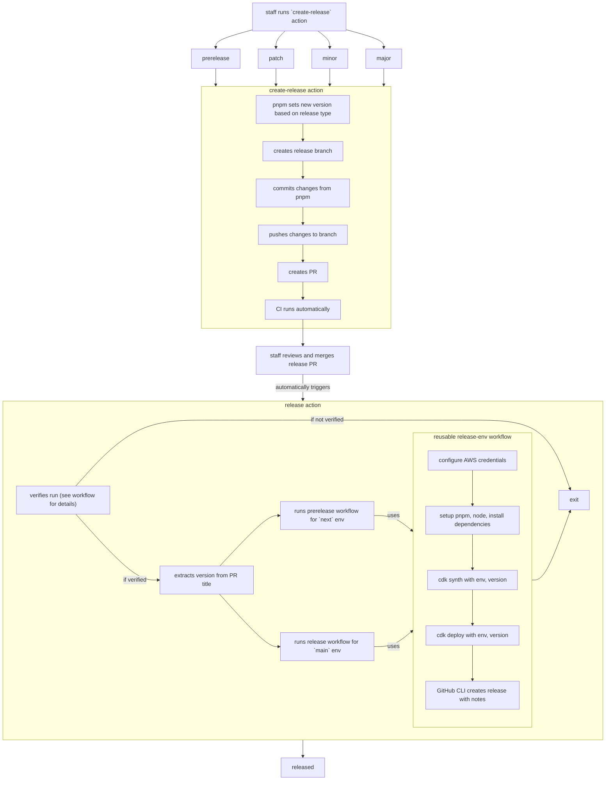

# Contributing

Refer to the [readme guide](./README.md#getting-started) to get started.

## Repository Reference

- [`cdk/`](./cdk) - AWS CDK application to deploy apps
- [`docs/`](./docs) - Documentation related to project including architecture diagrams
- [`e2e/`](./e2e) - End-to-end test suite powered by [Vitest](https://vitest.dev/), supports in-source unit testing
- [`packages/`](./packages) - collection of library packages, including Discord, support helpers, and a shared TypeScript configuration
- [`scripts/`](./scripts) - small CLI helper for automating tasks

## Architecture Reference


## Git Hooks

It is recommended to use the provided git hooks to save time by verifying your changes before filing a pull request.

```bash
git config core.hookspath .git-hooks
```

## Authoring Discord Commands

To get started, let's create a new command file in `src/lib/discord/commands`: `hello.ts`

```ts
import { createCommand, createOption } from '$discord'

const name = createOption({
  name: 'name',
  description: 'The name of the user to greet.',
  required: true,
  choices: ['world', 'everyone'],
})

export default createCommand({
  name: 'hello',
  description: 'Say hello',
  options: [name],
  handler: (context) => {
    const [name] = context.data.options
    return `hello ${name.value}`
  },
})
```

Save and register the new command with `commands.sync()`

**NOTE:** refresh your Discord client and optionally allow up to 30 minutes for commands to show in Discord

### Typical Workflow

Deploy for environment `next`

1. `pnpm cdk synth -c env=next`
2. `pnpm cdk deploy -c env=next`

Destroy resources associated with environment `next`

1. `pnpm cdk destroy -c env=next`

## Testing

Run the tests with `pnpm test`. This will launch Vite in `test` mode, which will load secrets from `.env.test` if it exists. In a CI setting it is recommended to use a separate set of secrets unique to the test flow.

You can also launch a UI for the tests with [`pnpm vitest --ui`](https://vitest.dev/guide/ui.html#vitest-ui)

### Unit Tests

This project supports [in-source testing powered by Vitest](https://vitest.dev/guide/in-source.html). To get started, at the **end of the file** add the following:

```ts
// ... implementation

if (import.meta.vitest) {
  const { test } = import.meta.vitest
  test.todo('my unit test')
}
```

When `pnpm test` is run from the project root, the newly added test is executed alongside the e2e tests.

## Releasing

1. developer creates a PR from their fork
2. maintainers review and add the `run-ci` label to [run the CI pipeline](./.github/workflows/ci.yml) and get the apporpriate status check
3. after PR requirements are met, maintainers merge to `main`
4. maintainers manually run the [`create-release`](./.github/workflows/create-release.yml) action with the desired version release (major, minor, patch, prerelease)
5. maintainers review and merge the automatically-created PR
6. GitHub Actions run [`release`](./.github/workflows/release.yml) action using the version specified in the PR title

This process uses one branch, `main`, and relies on the created releases and git tags to showcase the latest source code available in each environment (release -> `main` vs prerelease -> `next`).



### Creating Secrets in SSM

**[scripts](./packages/scripts)**

Create secrets in SSM Parameter Store with the `scripts` helper! Rename `.env.sample` to `.env.next` and create secrets with the following command:

```bash
pnpm scripts create-secrets -e next
```

**NOTE:** dotenv files are loaded using Vite's `loadEnv` and `local` dotenv files are not supported when creating secrets. Additionally, we must be sure to pass a valid environment name such as `main` or `next`

### Deployment

For the deployment we will work primarily in the [`cdk`](./cdk) directory, where the [AWS CDK CLI](https://www.npmjs.com/package/aws-cdk) is installed locally to the package.

1. if not already done, bootstrap the environment with `pnpm cdk bootstrap`
2. ensure we are able to synthesize the stack: `pnpm cdk synth`
   1. alternatively we can synthesize an environment-specific stack: `pnpm cdk synth -c env=next`
3. deploy the stack with `pnpm cdk deploy`

### Docker

Build individual apps using [`docker compose`](https://docs.docker.com/compose/):

- `docker compose up bot --build`

Build manually with:

```shell
docker build -t bot .
```

Run manually with:

```shell
docker run --rm \
  --name bot-local
  -p 3000:3000 \
  bot
```
