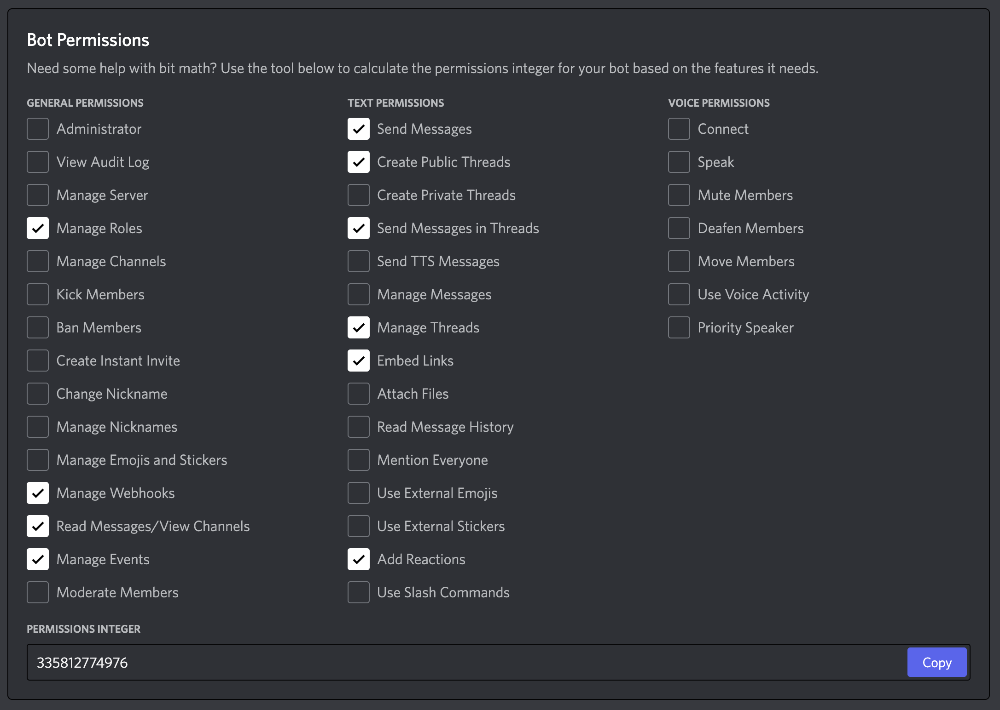

# AWS Amplify Discord Bot: "hey-amplify"

This repository contains the source code for the [AWS Amplify Discord Server](https://discord.gg/8RFCGKMfVM)'s bot.

## Features

- Auto-threads "help" channels: If a channel follows the `<category>-help` naming convention, messages will automatically get converted into threads.
  - Thread data is tracked by title, original poster ID, and whether the thread is solved (`GET /api/questions`).
- Dashboard component to visualize questions and channel "health."
- Support for GitHub to Discord webhooks (used for posting release notes).
- Command: `/admin mirror <repository>` accepts a REPOSITORY and posts the thread to GitHub Discussions.
- Command: `/contribute` - accepts an Amplify project argument and returns the GitHub contribution URL.
- Command: `/github` - accepts an Amplify project argument and returns the GitHub repository URL.
- Command: `/giverole` - accepts a ROLE and USER argument to grant a role. (Note: this command is disabled by default for `@everyone`).
- Command: `/login` sends an ephemeral link to login to GitHub and link accounts.
- Command: `/thread` - command suite for thread owners:
  - `/thread rename <title>` - allows thread owners to rename their threads.
  - `/thread archive` - allows thread owners to optionally archive their thread.
  - `/thread solved` - allows thread owners to mark their question (thread) as "solved," which changes prepended `?` with ✅.
  - `/thread reopen` - allows thread owners to "reopen" their question (thread), which changes prepended ✅ with `?`.
- Supports multiple guilds.

## Getting Started

**Pre-requisites**:

- Node.js v18.x
- pnpm v7.13.1

### Quick Start

1. Fork the repository: `gh repo fork aws-amplify/discord-bot`
2. Run `pnpm setup-dev`
3. Using `.env.sample` as a template, create a `.env` file and [add the necessary Discord environment values](#setting-up-a-discord-bot).
4. Run the application with `pnpm dev`
5. As the server owner, navigate to `http://localhost:3000/`, log in, and visit `/admin` to configure the instance.

### Setting up a Discord Bot

<!-- TODO: Add screenshots -->

1. (Optional) Create a [new Discord server](https://discord.new) or create one from the [AWS Amplify Discord server template](https://discord.new/vmyFvRYDtUsn).
2. [Register a Discord bot](https://discord.com/developers/applications).
3. Make a note of the App ID to add the bot to your Discord server using the following URL:
   ```text
   https://discord.com/api/oauth2/authorize?client_id=<app-id>&permissions=335812774976&scope=bot%20applications.commands
   ```
4. Enable OAuth and add `http://localhost:3000/api/auth/callback/discord` as a redirect URL.
5. Make a note of the OAuth secrets and populate your `.env` file.

#### Required Bot Permissions

The URL noted in step 3 above has the permissions integer of `335812774976`, which includes the following bot permissions:



## Contributing

Learn how to get started with our [contribution guide](./CONTRIBUTING.md).
