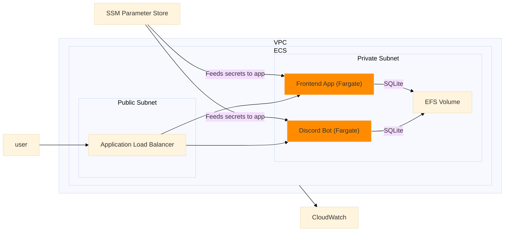

# hey-amplify Server Diagram

```mermaid
%%{init: {'theme':'base'}}%%
flowchart LR
    user
    ssm[SSM Parameter Store]
    cloudwatch[CloudWatch]

    subgraph vpc["VPC<br/>"]
        %% style vpc fill:#d9e7d6;
        direction LR
        subgraph ecs[ECS]
            %% style ecs fill:#f7c7a0;
            direction LR
            subgraph Private Subnet
                direction LR
                cBot["Discord Bot (Fargate)"]:::container
                cApp["Frontend App (Fargate)"]:::container
                efs["EFS Volume"]

                cBot -->|SQLite| efs
                cApp -->|SQLite| efs
            end
            subgraph Public Subnet
                alb["Application Load Balancer"]
            end

            alb --> cBot
            alb --> cApp
        end
    end

    ssm -->|Feeds secrets to app| cBot
    ssm -->|Feeds secrets to app| cApp
    user --> alb
    ecs --> cloudwatch


    classDef container fill:darkorange;
```
