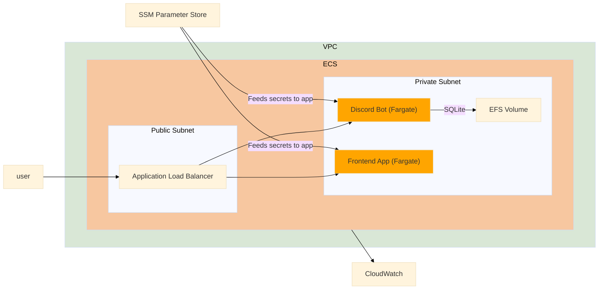

# hey-amplify Server Diagram

```mermaid
%%{init: {'theme':'base'}}%%
flowchart LR
    classDef container fill:orange;
    classDef subgraph_padding fill:none,stroke:none

    user
    ssm[SSM Parameter Store]
    cloudwatch[CloudWatch]

    subgraph vpc["VPC<br/>"]
    subgraph br1 [ ]

        direction TB
        style vpc fill:#d9e7d6;

        subgraph ecs[ECS]
        subgraph br2 [ ]

            style ecs fill:#f7c7a0;
            direction LR
            subgraph Private Subnet
                direction LR

                cBot["Discord Bot (Fargate)"]
                cApp["Frontend App (Fargate)"]
                efs["EFS Volume"]

                cBot -->|SQLite| efs

                class cBot container
                class cApp container
            end
            subgraph Public Subnet
                alb["Application Load Balancer"]
            end

            alb --> cBot
            alb --> cApp
        end
        end
    end
    end

    class br1 subgraph_padding
    class br2 subgraph_padding

    ssm -->|Feeds secrets to app| cBot
    ssm -->|Feeds secrets to app| cApp
    user --> alb
    ecs --> cloudwatch
```
