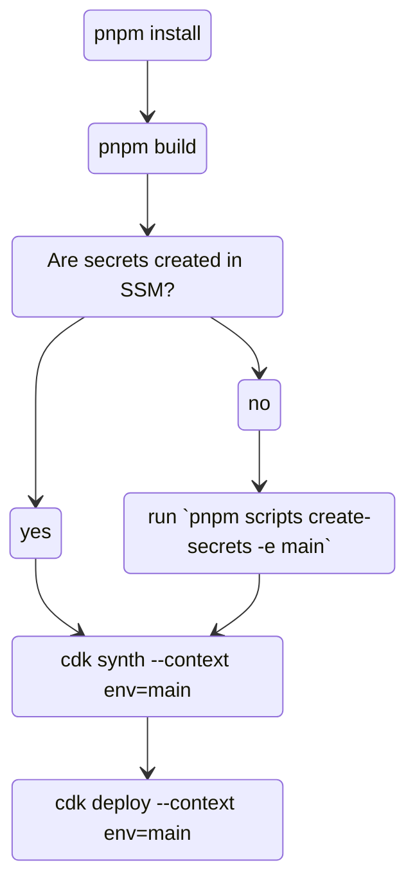

# Deployment Process

The following diagram servers as an example for deploying the environment `main` (the production environment)

```mermaid
stateDiagram-v2
  pinstall: pnpm install
  pbuild: pnpm build
  ssm: Are secrets created in SSM?
  createsecrets: run `pnpm scripts create-secrets -e main`
  cdkSynth: cdk synth --context env=main
  cdkDeploy: cdk deploy --context env=main

  pinstall --> pbuild
  pbuild --> ssm
  ssm --> yes
  ssm --> no
  no --> createsecrets

  yes --> cdkSynth
  createsecrets --> cdkSynth
  cdkSynth --> cdkDeploy
```
