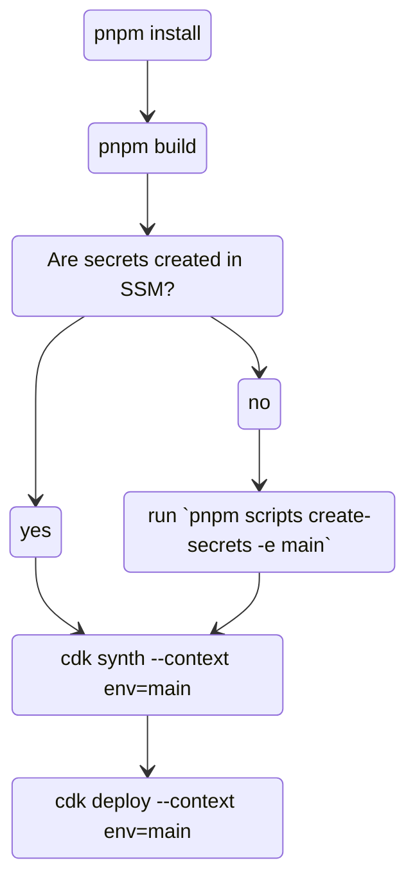

# Deployment Process

The following diagram servers as an example for deploying the environment `main` (the production environment). When working with multiple environments it is recommended to have separate dotenv files for each environment. In the following example secrets will be loaded from `.env` then `.env.main` using [Vite's `loadEnv` helper](https://vitejs.dev/config/#environment-variables).

