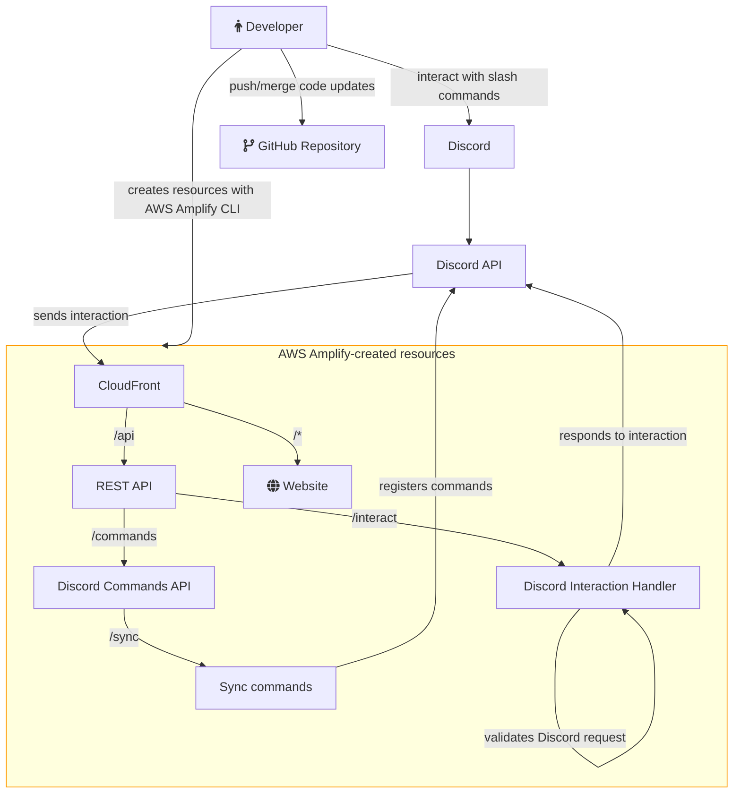

# hey-amplify Server Diagram

```mermaid
flowchart
    entityDeveloper[fa:fa-person Developer]
    entityDiscord[Discord]
    entityDiscordApi[Discord API]
    entityGitHub[fa:fa-code-branch GitHub Repository]
    subgraph amplify [AWS Amplify-created resources]
        style amplify stroke:#f90
        amplifyCloudfront[CloudFront]
        amplifyRestApi[REST API]
        website[fa:fa-globe Website]
        amplifyCloudfront -->|/*| website
        amplifyCloudfront -->|/api| amplifyRestApi
        %% unfortunately "lambda" icon is not yet available
        amplifyRouteInteraction[fa:fa-lambda Discord Interaction Handler]
        %% amplifyRouteCommandsApi[fa:fa-lambda Discord Command API]
        amplifyRouteCommandsApi["Discord Commands API"]
        amplifyRouteCommandsApi -->|/sync| amplifyRouteCommandsSync[Sync commands]
        amplifyRouteInteraction -->|validates Discord request| amplifyRouteInteraction
        amplifyRestApi -->|/interact| amplifyRouteInteraction
        amplifyRestApi -->|/commands| amplifyRouteCommandsApi
    end
    entityDeveloper -->|interact with slash commands| entityDiscord
    entityDiscord --> entityDiscordApi
    entityDeveloper -->|creates resources with AWS Amplify CLI| amplify
    entityDeveloper -->|push/merge code updates| entityGitHub
    entityDiscordApi -->|sends interaction| amplifyCloudfront

    %% responding to Disord API directly
    amplifyRouteInteraction -->|responds to interaction| entityDiscordApi
    amplifyRouteCommandsSync -->|registers commands| entityDiscordApi
```
