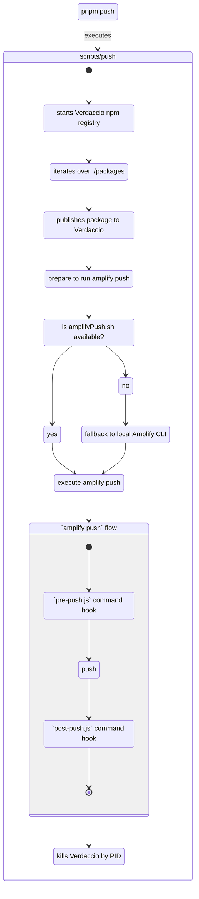

# How "pnpm push" works

```mermaid
stateDiagram-v2
  ppush: pnpm push
  ppush --> scripts/push: executes
  state scripts/push {
    sVerdaccio: starts Verdaccio npm registry
    eVerdaccio: kills Verdaccio by PID
    [*] --> sVerdaccio
    iterate: iterates over ./packages
    publish: publishes package to Verdaccio
    amplifyPush: prepare to run amplify push
    sVerdaccio --> iterate
    iterate --> publish
    publish --> amplifyPush
    state amplifyPush
      helperScriptAvailable: is amplifyPush.sh available?
      fallback: fallback to local Amplify CLI
      amplifyPush --> helperScriptAvailable
      helperScriptAvailable --> yes
      helperScriptAvailable --> no
      executeAmplifyPush: execute amplify push
      no --> fallback
      yes --> executeAmplifyPush
      fallback --> executeAmplifyPush
    amplifyPushFlow: `amplify push` flow
    executeAmplifyPush --> amplifyPushFlow
    state amplifyPushFlow {
      prepush: `pre-push.js` command hook
      push: push
      postpush: `post-push.js` command hook
      [*] --> prepush
      prepush --> push
      push --> postpush
      postpush --> [*]
    }
    amplifyPushFlow --> eVerdaccio
  }
```
