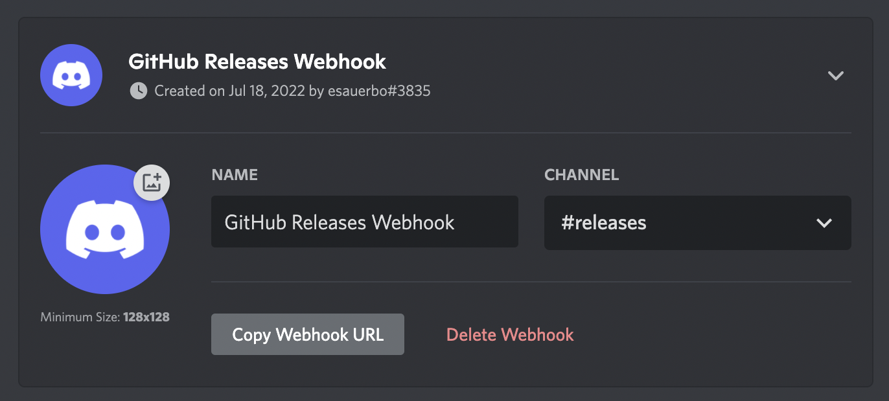
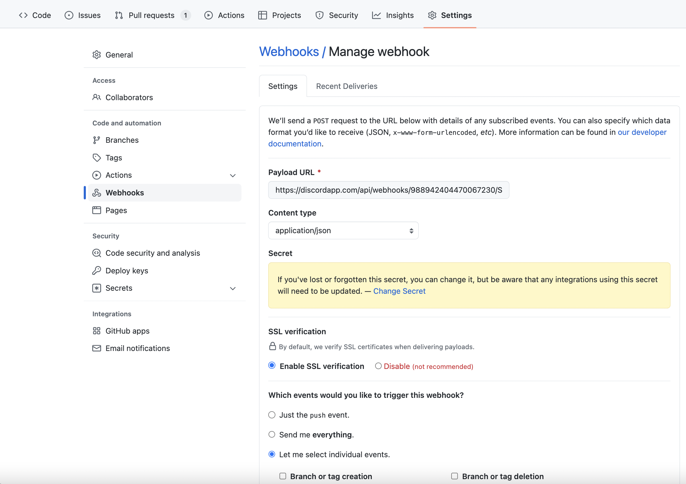

## Configuring a Github -> Discord Webhook
### Create Webhook in Discord Channel

 - Go to server settings (click on the server name -> **Server Settings**)
 - Go to **integrations** -> **View Webhooks**
 - Click **New Webhook**
 - Add a descriptive name ('GitHub Releases Webhook' would work)
 - Select **#releases** as the channel
 - Copy the **Webhook URL** 
 - Add the url to your `.env` file as `DISCORD_WEBHOOK_URL_RELEASES`
 
 

### Create the GitHub Webhook
You must be the owner of the GitHub repository to perform the following steps.

 - Go to the desired GitHub repository, and click **Settings**
 - Click **Webhooks** -> **Add Webhook**
 - Under **Payload URL** , paste in the Discord Webhook URL with `/github` appended to the end
 - Under **Content type**, select `application/json`
 - You can leave the **Secret** section blank
 - Select  **Let me select individual events** then choose `releases`
 - Click **Add Webhook**
 
 

Now the GitHub -> Discord releases webhook should be configured!